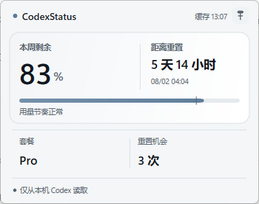
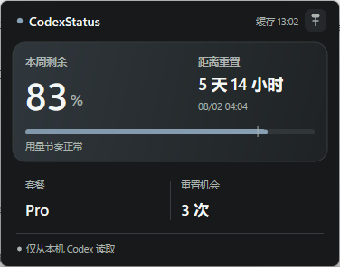

<div align="center">

# CodexStatus

**Your Codex weekly quota, readable at a glance in the Windows tray.**

[简体中文](README.zh-CN.md) · [Download](https://github.com/mmm1h/codex-status/releases/latest) · [Report an issue](https://github.com/mmm1h/codex-status/issues)

</div>

| Light | Dark |
|:--:|:--:|
|  |  |

CodexStatus is a tiny native Windows utility. Its notification-area icon is the number itself—`0` to `100`, or `--` when no trustworthy value is available. Click it for reset timing, usage pace, the optional five-hour window, plan information, and refresh status.

## Highlights

- Weekly remaining quota drawn directly into the standard tray icon.
- Transparent, theme-aware Segoe UI digits with a restrained green (≥50%), amber (20–49%), red (<20%), or muted status rule.
- Direct2D + DirectWrite rounded flyout with ClearType typography, restrained data visualization, and light, dark, high-contrast, and per-monitor DPI support.
- System, light, and dark flyout themes selectable from the tray menu.
- Silent daily updates from verified GitHub Release assets, followed by an automatic restart.
- Official Codex app-server RPC: `account/rateLimits/read`; no token scraping and no private endpoints.
- Event-driven Win32 process with no Electron, WebView, WPF, WinUI, local HTTP server, or resident async runtime.
- Five-minute default refresh, manual refresh, bounded failure backoff, safe cache expiry, and optional low-quota alerts.
- Weekly and five-hour alert thresholds, projected-exhaustion warnings, recovery alerts, and a built-in notification test.
- Weekly, five-hour, or lowest-of-both tray display; the details card hides unavailable windows instead of inventing values.
- Optional official OpenAI status checks, copyable status/diagnostics, a pinnable card, and a `Ctrl+Alt+Q` shortcut.
- Quota and service checks pause while Windows is locked or asleep and resume with one fresh read.
- Single instance, Explorer-restart recovery, multi-monitor placement, and optional start with Windows.
- English and Simplified Chinese UI, selected from Windows automatically.

## Install

CodexStatus requires Windows 10/11 x64 and an already installed, signed-in [Codex CLI or Codex app](https://developers.openai.com/codex/cli/).

1. Download the per-user installer from [Releases](https://github.com/mmm1h/codex-status/releases/latest).
2. Run it. The default location is `%LOCALAPPDATA%\Programs\CodexStatus` and start-with-Windows is enabled by default.
3. If Windows places the new icon behind the overflow arrow, open that area and drag CodexStatus onto the visible tray. Windows—not applications—controls notification icon visibility.

The installer is not yet code-signed, so Microsoft Defender SmartScreen may show an “unrecognized app” warning. Release assets include SHA-256 checksums. The portable ZIP makes no startup changes; enable startup from the right-click menu if desired.

## Use

- **Left-click:** open or close the quota card.
- **Right-click:** refresh, choose the tray metric, configure weekly/five-hour/pace/recovery alerts, select a theme, pin the card, copy status or diagnostics, check OpenAI status, toggle `Ctrl+Alt+Q`, manage startup, or exit.
- **Tray label:** weekly remaining by default; optionally the five-hour value or the lower of both, rounded to the nearest whole number.
- **Quota bar marker:** compares quota remaining with time remaining in the current weekly cycle and flags a pace that projects exhaustion before reset.

CodexStatus only calls the locally installed `codex app-server`. Each refresh performs `initialize → account/read → account/rateLimits/read`, then closes the process tree using a Windows Job Object. It selects an exact 10,080-minute window first and only accepts a 6–8 day fallback; a short window is never mislabeled as weekly quota.

## Privacy

CodexStatus never reads or stores your OAuth token, email address, project content, prompts, or raw app-server response. It sends no telemetry. Service checks read only the public `status.openai.com` summary, send no credentials, run at most every 15 minutes, and can be disabled from the tray menu. For automatic updates, it reads the public latest-release metadata from `api.github.com` at most once per day and downloads an executable only when a newer stable version exists. The file must match the SHA-256 digest published by GitHub before it can replace the current executable.

Two files are stored under `%LOCALAPPDATA%\CodexStatus`:

- `settings.json`: refresh interval, UI language, theme, tray metric, notification choices, shortcut/pin choices, onboarding state, last successful update check, and alert deduplication state.
- `snapshot.json`: the latest non-sensitive parsed quota snapshot. It is discarded once its reset time passes.

Normal builds do not write logs. The optional `diagnostics` Cargo feature records only lifecycle stages and filtered error summaries.

## Performance

Measured on Windows 11 24H2 x64 with a 120.77-second local v0.4.0 x64 Release residency sample after closing the flyout:

| State | CodexStatus working set | CPU | Child processes |
|---|---:|---:|---:|
| Idle after the flyout closes | 3.56 MB average / 3.86 MB maximum | 0.0% observed | 0 |
| Refreshing | <15 MB for the tray process | brief | 1 temporary `codex app-server` tree |

The sample ended with two threads, fewer handles than it started, no change in GDI or USER object counts, and no child process. Direct2D and DirectWrite are loaded only while the card is visible; their objects are released when it closes and the working set is trimmed shortly afterward. The app-server process has a larger transient footprint because it is Codex itself; it exits immediately after the two account calls complete and is not part of the resident tray process. If Direct2D initialization ever fails, the previous GDI renderer remains available as a fallback.

## Build

The supported release target is stable Rust with `x86_64-pc-windows-msvc`:

```powershell
cargo fmt --check
cargo clippy --all-targets -- -D warnings
cargo test --all-targets
cargo build --release --locked
```

GitHub Actions builds the portable ZIP and Inno Setup installer for version tags. Local development can also use the gnullvm target; llvm-mingw's `libunwind.dll` is then a development-only runtime dependency. Official release builds use MSVC and are a single executable.

## Design boundaries

CodexStatus intentionally does not inject private taskbar UI, collect cost/token history, support other providers, or expose a local server. Windows does not offer a supported API for forcing a tray icon to remain visible, so pinning is always the user's choice.

## Thanks

CodexStatus was informed by the interaction and information design of [CodexBar](https://github.com/steipete/CodexBar), [TaskbarQuota](https://github.com/zioder/TaskbarQuota), [CodexQuotaTaskbar](https://github.com/zHysie/CodexQuotaTaskbar), [codex-win-widget](https://github.com/Mauriciog87/codex-win-widget), and [Claude & Codex Battery](https://github.com/dennykim123/claude-codex-battery). Its compact flyout also takes cues from [Windows app design guidance](https://learn.microsoft.com/windows/apps/design/), [Twinkle Tray](https://github.com/xanderfrangos/twinkle-tray), and [EarTrumpet](https://github.com/File-New-Project/EarTrumpet). No source code was copied from those projects.

The quota transport follows the official [Codex app-server rate-limit documentation](https://learn.chatgpt.com/docs/app-server#6-rate-limits-chatgpt). Notification-area behavior follows [Microsoft's guidance](https://learn.microsoft.com/windows/win32/uxguide/winenv-notification).

## License

[MIT](LICENSE)
